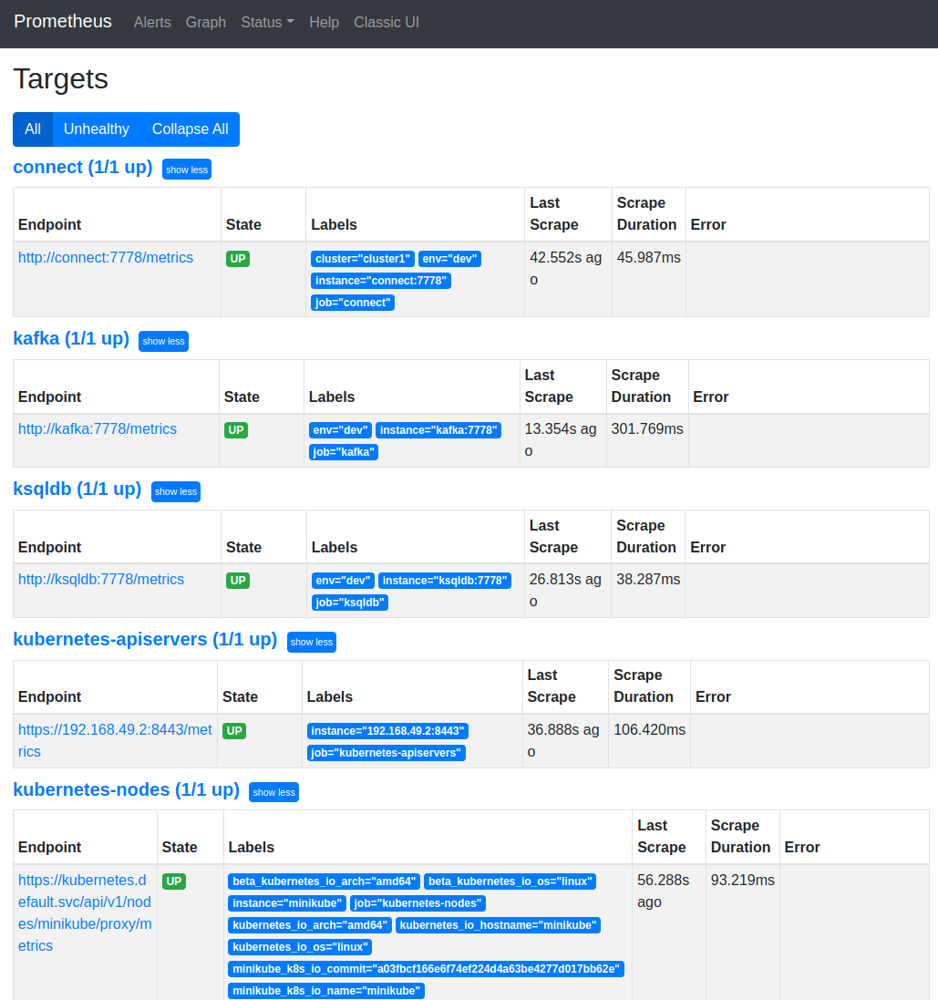
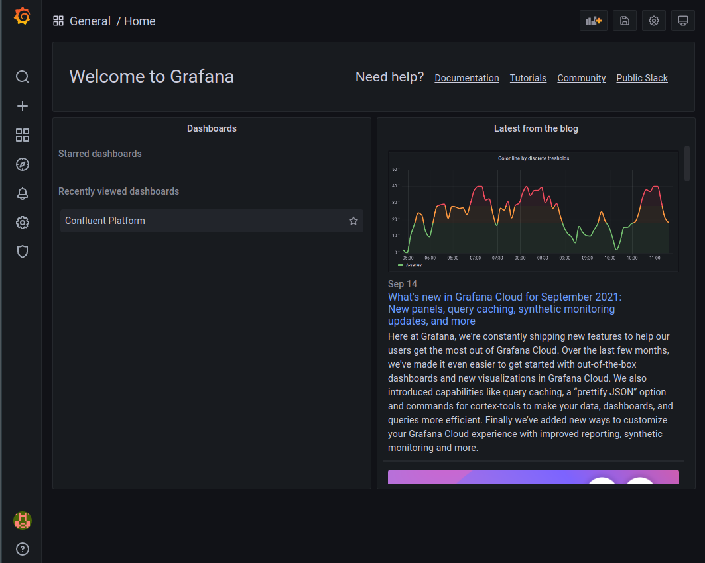
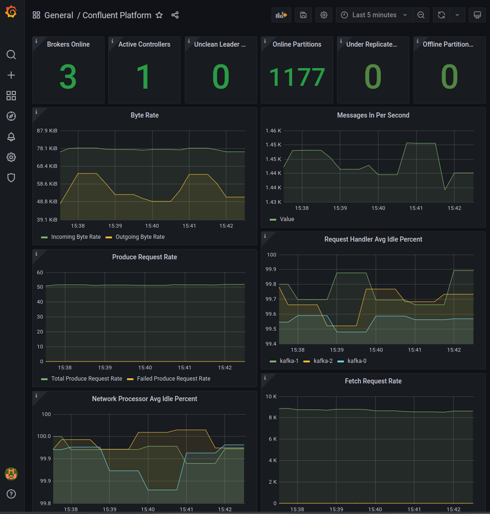

# Tiered Storage

| Feature          | Enabled | Note                     |
|:-----------------|:-------:|:-------------------------|
| Kafka/Zookeeper  |    ✅    |                          |
| Control Center   |    ✅    |                          |
| Connect          |    ❌    |                          |
| Schema Registry  |    ❌    |                          |
| KSQL             |    ❌    |                          |
| TLS Encryption   |    ✅    | Self-signed certificates |
| Authentication   |    ✅    |                          |
| Authorization    |    ✅    | via LDAP                 |


## 

Once all the the pods are in a 'Running' status, we can start to investigate the rest of the stack.

## Prometheus
Prometheus has a UI you can view by forwarding port 9090 with the following command, and then accessing `http://127.0.0.1:9090` from a local browser.
```shell
kubectl port-forward \
$(kubectl get pods -n sandbox -l app=prometheus -l component=server -o name) \
9090 --namespace sandbox
```

If you navigate to `http://localhost:9090/targets` you should hopefully see a screen such as this which indicates that Prometheus is successfully scraping from the Confluent Services
0

The configuration file for Prometheus can be found at `./examples/monitoring/prometheus/server/cm.yaml` 

## Grafana
Grafana's Web UI runs on port 3000.  Similar to Prometheus, forward that port to your local machines with the following command:
```shell
kubectl port-forward \
$(kubectl get pods -n sandbox kubectl get pods -n sandbox -l app.kubernetes.io/component=grafana -o name) \
3000 --namespace sandbox
```

Navigate to http://localhost:3000

You will need to login with the username 'admin' and the password 'password'.  At the home screen you will see a dashboard called 'Confluent Platform'.  Click on this


This dashboard will display various metrics/alerts for the various Confluent services.  This dashboard has been captured in code, and can be edited at `./examples/grafana/dashboards.yaml`



