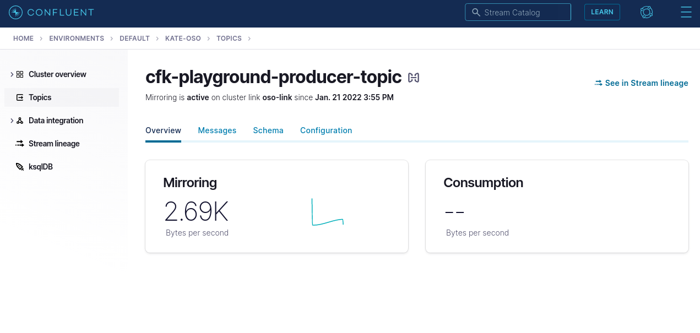

# Cluster Linking (Confluent Platform -> Confluent Cloud)
An example which shows how to cluster link a topic from local to Confluent Cloud.

## Features

| Feature         | Enabled | Note                            |
|:----------------|:-------:|:--------------------------------|
| Kafka/Zookeeper |    ✅    |                                 |
| Control Center  |    ✅    |                                 |
| Connect         |    ❌    |                                 |
| Schema Registry |    ❌    |                                 |
| KSQL            |    ❌    |                                 |
| TLS Encryption  |    ✅    | Self-signed certificates        |
| Authentication  |    ✅    |                                 |
| Authorization   |    ✅    | via LDAP                        |
| Cluster Linking |    ✅    | Cluster link to Confluent Cloud |


## Prerequesites - Variable Gathering
### ConfluentCLI
https://docs.confluent.io/ccloud-cli/current/install.html
### Create a dedicated Confluent Cloud Cluster, and obtain clusterID.
After creating your Confluent cloud *DEDICATED* cluster (standard and basic clusters will NOT work), we need to capture some information regarding the cluster (alternatively, this information can be gathered via the WebUI)

### Log on to Confluent Cloud from local machine
* From your local machine run `confluent login`, you will be asked for the same credentials you use to log into https://confluent.cloud/.

### Obtain Cluster ID
* After successfully logging in, find your confluent cluster ID, by running `confluent kafka cluster list`, you should see your cluster, and it's ID (something like 'lkc-d22k7').  We will refer to this ID later as `CC_CLUSTER_ID`

### Create API KEYs to Confluent Cloud
* Generate an API Key/Secret by running `confluent api-key create --resource $CC_CLUSTER_ID`

```
➜  confluent api-key create --resource lkc-rqqyk
It may take a couple of minutes for the API key to be ready.
Save the API key and secret. The secret is not retrievable later.
+---------+------------------------------------------------------------------+
| API Key | 4I4O5OHFVLLYAB4C                                                 |
| Secret  | wWQDkRN5CcrMDnnA----Gm6jvZQyitw0ZuIqBoeQ5evnXLsn1pAa1tREeefbRy54 |
+---------+------------------------------------------------------------------+
```

Save these values, they will referred to later as `CC_API_KEY`, and `CC_API_SECRET` respectively.

### Gather Confluent Cloud End Point
* Acquire the Bootstrap endpoint by running `confluent kafka cluster describe $CC_CLUSTER_ID`.  We are looking for the value 'ENDPOINT', which will look something like: **SASL_SSL://pkc-v1gj5.eu-west-2.aws.confluent.cloud:9092**.  Later on, we will substitute the SASL_SSL prefix (for https), are refer to it as `$CC_BOOTSTRAP_SERVER`

### Populate Variables
In the file ./linking-script/link-provision update the pod variables stored at spec.containers.env. with the variables we made note of above. 

## Deployment
Proceed with deployment as described in `./GETTING_STARTED.md`.  Whilst our cluster is coming up, our cluster-link-provision pod will be running the necessary command line operations required to setup the link between Confluent Platform and Confluent Cloud.

After the CP cluster becomes available, you should see successful connection messages in the 'cluster-link-provision' logs that indicate links have been configured: 

```
Cluster link 'oso-link' creation successfully completed.                                               
Cluster link 'oso-link' creation successfully completed.  
```


## Mirror Topics
Deployed with this example is a sample producers (a pod named 'console-producer') which is writing to the topic `cfk-playground-producer-topic`.  To mirror this topic to confluent cloud, we run the following command from our local terminal:
```
➜ confluent kafka mirror create cfk-playground-producer-topic --link oso-link --cluster lkc-rqqyk
Created mirror topic "cfk-playground-producer-topic"
```
In Confluent Cloud, a successfully mirrored topic will look as such:


