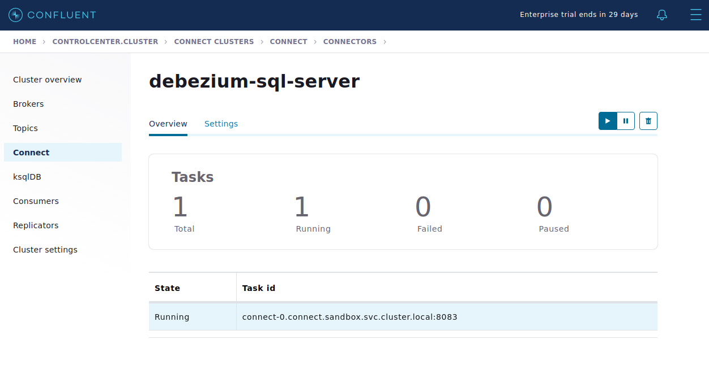
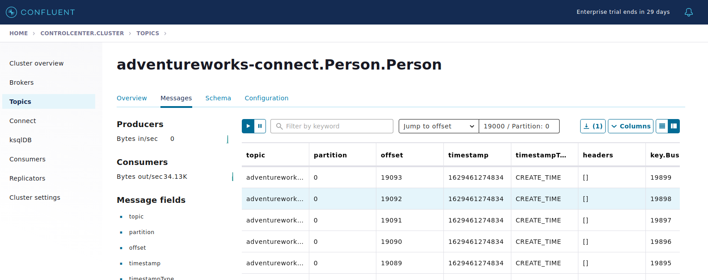

## Custom Connect Image / Debezium SQL Server
In this example we go through the following process:

* Build a 'custom' kafka connect image with [Debezium](https://debezium.io/) plug-in, and make available to the internal (minikube) kubernetes cluster
* Initiate a SQLServer stub populated with the traditional '[AdventureWorks](https://docs.microsoft.com/en-us/sql/samples/adventureworks-install-configure?view=sql-server-ver15&tabs=ssms)' database, and enable [CDC](https://en.wikipedia.org/wiki/Change_data_capture) on select tables
* Deploy a connector via a cURL command
* Observe how changes to CDC enabled tables will trigger events in Kafka

NOTE: For ease of readability, we will simply reference the scripts that perform the actions of the following stages.  For better understanding of what is actually being done, please review the scripts themselves which will have their own comments/notations.  **Assumptions are that you will be running all commands from the present directory**

### Building the custom docker image
The Dockerfile installs a custom plugin with the following line: `RUN confluent-hub install --no-prompt debezium/debezium-connector-sqlserver:1.6.0`.  To build, run:

```shell
cd docker && ./build-inside.sh && cd ..
```
### Deploy CFK CRDs & Confluent Components
Deploy the CRDS using the standard way:
```shell
kubectl apply -k ../../kustomize/crds && sleep 1 && kubectl apply -k .
```
### Enable CDC on 'person' table of AdventureWorks Database
CDC needs to be enabled on a table by table basis.  This table is also referenced in the prod-mssql-connnector.json file. 
```shell
cd connect-scripts
./enable_cdc.sh
Context "minikube" modified.
Changed database context to 'AdventureWorks'.
Job 'cdc.AdventureWorks_capture' started successfully.
Job 'cdc.AdventureWorks_cleanup' started successfully.
```
### Deploy Debezium Connector
A curl request is sent to the 'connect pod' to install the connector.  First we need to forward the kafka connect port to our localhost:

```shell
kubectl port-forward \
$(kubectl get pods -n sandbox -l app=connect -o name) \
8083:8083 --namespace sandbox
```
In a separate terminal window, run:
```shell
./deploy_connector.sh
```

At this stage, if you log onto Control Center, you should see a running connector:



### Update CDC enabled 'Person' table
Now we will send a SQL Command that will update all users in the person.Person table on the AdventureWorks database:

```shell
./update_person.sh
Context "minikube" modified.
Changed database context to 'AdventureWorks'.

(19972 rows affected)
```
If you observe the automatically created topic `adventureworks-connect.Person.Person` you will see the update event messages streaming through


